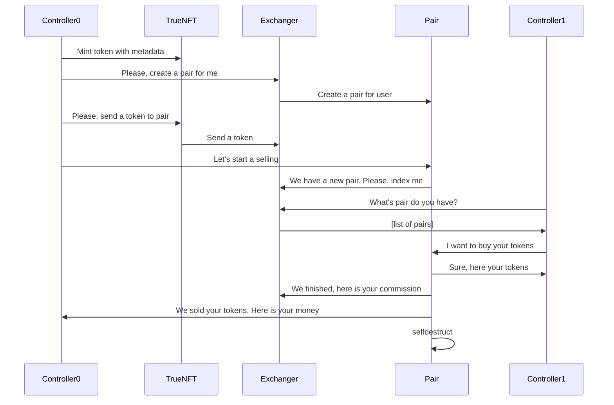

Market
========

This page about how contract market work.

## Contracts

Exist some kind of types contracts to exchange

* Exchanger
* Controller
* TrueNFT
* Pair
    * NftAuction
    * NftPair

This diagram show how they work with each other to sell token

## How to read it
### What is a variables?
Its getter methods without any param in input and with one output.
### What is a getter?
Its getter methods with params and some output or without parms and some outputs.